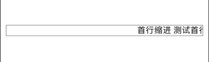
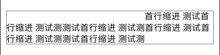

# NSAttributedStringSizeBug
NSAttributedString Size Computer Bug Demo

### NSAttributedString 高度计算的陷阱：  
#### 当原来的文本只有一行的时候，不会因为首行缩进变成两行，而且超出边界文本被截掉  
```
首行缩进是NSMutableParagraphStyle的firstLineHeadIndent属性
```

  
#### 只有首行缩进为0时就已经是多行的，增加首行缩进才对高度计算有影响  

